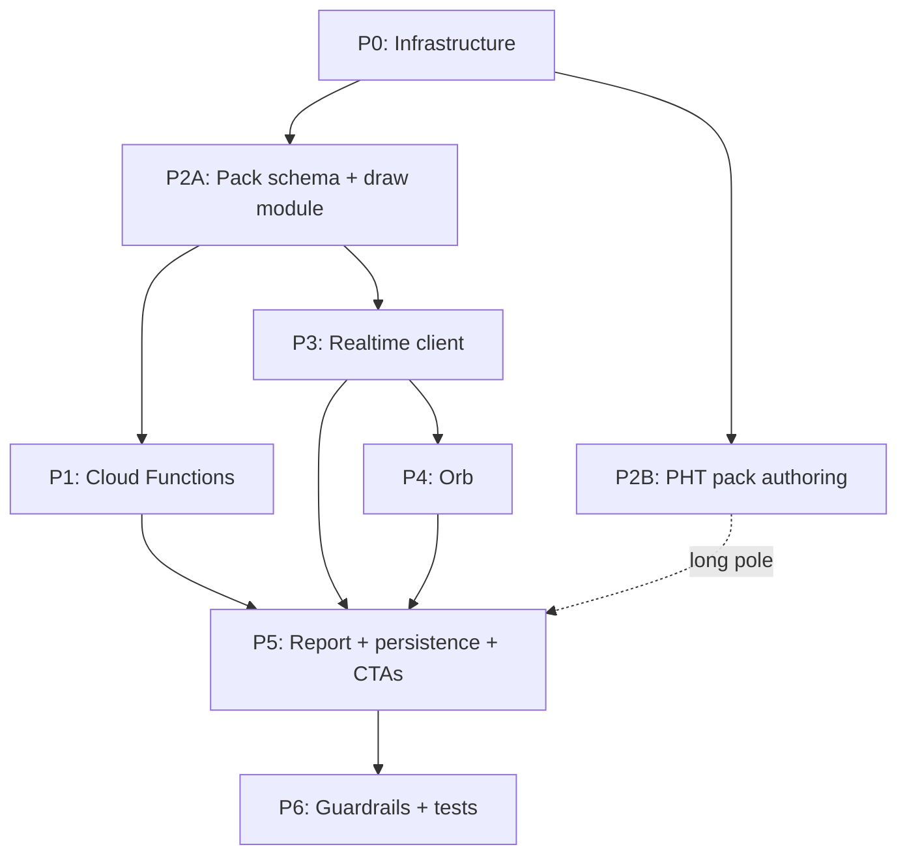

# Capstone Interview — Phase Specs Index & Shared Contracts

This directory contains the 7 phase specs (P0–P6) that expand [ADR-0008: AI Capstone Interview — Realtime, Grounded](../adr/0008-ai-capstone-interview-realtime-grounded.md). Each phase doc is self-contained for its scope but depends on the shared contracts defined here; phase docs link back to this README rather than duplicating them. The original question-grounding decision lives in [ADR-0005: AI Interview Questions — Grounded and Engine-Verified](../adr/0005-ai-interview-questions-grounded-and-engine-verified.md).

The feature is an **optional, one-time spoken AI quant mock-interview** a learner takes after finishing all lessons in a concept. It runs on the OpenAI Realtime speech-to-speech API: the browser connects directly to OpenAI over WebRTC using a short-lived ephemeral token minted by a Cloud Function; the standing `OPENAI_API_KEY` never leaves the server. The interviewer is grounded in a per-concept, engine-verified "interview pack" (verified question bank + hidden answers/rubric + interviewer prompt) injected as hidden ground truth — it asks from the verified bank and qualitative follow-ups only, never inventing numeric problems. Grading is a separate server-side LLM pass over the transcript that writes an interview report. Audio is never stored. The interview does **not** gate the concept-mastered medallion or any unlocks.

---

## Phase index

All phases are **Status: Planned — not yet built.**

| File | Summary | Depends on |
|---|---|---|
| [`phase-0-infrastructure.md`](phase-0-infrastructure.md) | Firebase Hosting CSP/Permissions-Policy, `OPENAI_API_KEY` secret setup, new npm deps, pack→functions bundling | — |
| [`phase-1-cloud-functions.md`](phase-1-cloud-functions.md) | `mintInterviewToken` (server draw + caps + quota + App Check + token mint) and `gradeInterview` callables; client wrappers | P0, P2A |
| [`phase-2-interview-pack-content.md`](phase-2-interview-pack-content.md) | Shared Zod pack schema + hidden-stripped loader + draw module + validate script (2A); authoring the pattern-hitting-times pack (2B) | P0 |
| [`phase-3-realtime-client.md`](phase-3-realtime-client.md) | `/interview/:conceptId` route + `InterviewPage` + `useRealtimeInterview` (WebRTC, transcript, typed fallback, 8-min countdown) | P1, P2A |
| [`phase-4-orb.md`](phase-4-orb.md) | `Orb.tsx` — audio-reactive WebGL sphere driven by Realtime events | P3 |
| [`phase-5-report-persistence-and-ctas.md`](phase-5-report-persistence-and-ctas.md) | Report UI + attempts read layer + `firestore.rules` + CTAs + analytics | P1, P3 |
| [`phase-6-guardrails-and-tests.md`](phase-6-guardrails-and-tests.md) | Guardrail hardening + unit/rules/e2e tests | P0–P5 |

---

## Shared contracts

### Module / file map

**New shared/client files**

| Path | Purpose |
|---|---|
| `src/content/interviewPack.ts` | Zod `InterviewPackSchema` + types `InterviewPack` / `Question` / `ClientQuestion` + `toClientPack()` |
| `src/content/interviewDraw.ts` | Pure draw + seen-set logic |
| `src/interview/functions.ts` | Callable wrappers (`mintInterviewToken`, `gradeInterview`) |
| `src/interview/useRealtimeInterview.ts` | WebRTC hook (transcript, typed fallback, 8-min countdown) |
| `src/interview/Orb.tsx` | Audio-reactive WebGL sphere |
| `src/interview/attempts.ts` | Client read: subscribe + latest/best selectors |
| `src/pages/InterviewPage.tsx` | `/interview/:conceptId` page |
| `src/styles/surfaces/interview.css` | Interview surface styles |

**New server files**

| Path | Purpose |
|---|---|
| `functions/src/interview.ts` | Both callables + draw/quota/grade helpers; re-exported from `functions/src/index.ts` |
| `functions/<pack-dir>/` | Bundled pack JSON (see P0 for bundling details) |

**New content / build files**

| Path | Purpose |
|---|---|
| `interviews/_build/build-pattern-hitting-times-pack.ts` | Generates `interviews/course-pattern-hitting-times.json` |
| `interviews/_build/render-pht-md.ts` | Renders `.md` preview of the PHT pack |
| `interviews/_build/verify-pht-pack.ts` | Schema + engine cross-check for PHT pack |
| `interviews/_build/verify-pht-independent.ts` | Independent verification of PHT answers |
| `scripts/validate-interview-packs.ts` | Validates all packs; hooked as `validate:interviews` in `package.json` |

**Edited files**

| Path | Change |
|---|---|
| `firebase.json` | CSP + `Permissions-Policy` headers |
| `functions/tsconfig.json`, `functions/package.json` | Bundling config + new deps |
| `functions/src/index.ts` | Re-export interview callables |
| `src/pages/routes.ts` | `interviewPath(conceptId)`, `parseInterviewId(pathname)`, `ROUTES.devInterview` |
| `src/App.tsx` | Lazy `InterviewPage` + route |
| `src/pages/DevRoutes.tsx` | `/dev/interview` harness |
| `src/styles/app.css` | `@import` interview surface CSS |
| `src/analytics/events.ts` | `interview_*` events |
| `firestore.rules` | Three interview subcollection blocks |
| `tests/firestore.rules.test.ts` | Interview rules tests |
| `src/lesson/LessonPlayer.tsx` | Lesson-complete CTA |
| `src/pages/StudyDesk.tsx` or `src/pages/CourseJourney.tsx` | Concept-complete CTA |

---

### Firestore layout

All three subcollections are **Function-owned**: Functions write, client read is owner-only, client write is denied (mirrors the milestones/streaks pattern in `firestore.rules`).

```
users/{uid}/interviews/{attemptId}
  Written pending at mintInterviewToken; finalized at gradeInterview.
  {
    conceptId:      string
    questionId:     string
    fingerprint:    string
    tier:           "hard" | "harder" | "brutal"
    mode:           "voice" | "text"
    status:         "pending" | "graded" | "abandoned"
    startedAt:      Timestamp
    durationSec?:   number
    transcript?:    Turn[]
    report?:        InterviewReport
    createdAt:      Timestamp
    gradedAt?:      Timestamp
  }
  Audio is NEVER stored.

users/{uid}/interviewUsage/{day}
  day key = "YYYY-MM-DD" in learner's local timezone.
  {
    date:         string   // "YYYY-MM-DD"
    secondsUsed:  number
    sessionCount: number
    updatedAt:    Timestamp
  }

users/{uid}/interviewState/{conceptId}
  {
    seenQuestionIds: string[]
    attemptCount:    number
    lastAttemptAt:   Timestamp
  }
```

---

### Caps / constants

These are **load-bearing** and **enforced server-side** at mint time. The client also enforces `SESSION_CAP_SECONDS` via a countdown that force-stops the session.

| Constant | Value | Notes |
|---|---|---|
| `SESSION_CAP_SECONDS` | `480` | 8 min hard per-session |
| `DAILY_QUOTA_SECONDS` | `1800` | 30 min per user per day |
| `TOKEN_TTL_SECONDS` | `600` | `expires_after.seconds` at mint; must be ≥ session cap |
| Realtime model | `gpt-realtime` | `gpt-realtime-mini` is the cost/latency option |
| Realtime voice | `marin` | Recommended by OpenAI |
| Grader model | `gpt-5.5` | Reasoning-capable; pin a snapshot for production |

---

### Interview pack schema

Defined in `src/content/interviewPack.ts`. Mirror `src/content/schema.ts` house style: exported `const ...Schema = z....`, `z.infer` types at the bottom, `z.discriminatedUnion`/`z.tuple` where apt. The existing EV pack at `interviews/course-expected-value.json` is the canonical reference instance — the schema must parse it exactly.

```ts
// src/content/interviewPack.ts

const QuestionSchema = z.object({
  id:          z.string(),
  tier:        z.enum(["hard", "harder", "brutal"]),
  fingerprint: z.string(),
  template: z.object({
    id:     z.string(),
    params: z.record(z.unknown()),
  }).optional(),           // omitted => free-form question
  prompt:  z.string(),
  source:  z.string(),
  engineCheck: z.object({
    module:   z.string(),
    calls:    z.array(z.string()),
    answer:   z.string(),
    verified: z.boolean(),
  }),
  hidden: z.object({
    answer:      z.string(),
    approaches:  z.array(z.string()),
    wrongTurns:  z.array(z.string()),
    hintLadder:  z.tuple([z.string(), z.string(), z.string()]),
    rubric: z.object({
      correctness:   z.string(),
      approach:      z.string(),
      rigor:         z.string(),
      communication: z.string(),
      speed:         z.string(),
    }),
  }),
  followUps: z.array(z.string()),
});

const InterviewPackSchema = z.object({
  version:        z.literal(1),
  kind:           z.literal("interview-pack"),
  courseId:       z.string(),
  concept:        z.string(),
  greenBookAnchor: z.string(),
  engineModule:   z.string(),
  generator:      z.string(),
  note:           z.string(),
  counts: z.object({
    total:     z.number(),
    byTier: z.object({
      hard:   z.number(),
      harder: z.number(),
      brutal: z.number(),
    }),
    templated: z.number(),
    freeForm:  z.number(),
  }),
  interviewerPrompt: z.string(),  // server-only; stripped by toClientPack()
  generatorPrompt:   z.string(),  // server-only; stripped by toClientPack()
  templates: z.array(z.object({
    id:           z.string(),
    title:        z.string(),
    source:       z.string(),
    description:  z.string(),
    engineModule: z.string(),
  })),
  questions: z.array(QuestionSchema),
});

// ClientQuestion = Question with hidden dropped + engineCheck reduced
const ClientQuestionSchema = QuestionSchema
  .omit({ hidden: true })
  .extend({
    engineCheck: z.object({
      module:   z.string(),
      verified: z.boolean(),
      // calls and answer are stripped
    }),
  });

export type InterviewPack    = z.infer<typeof InterviewPackSchema>;
export type Question         = z.infer<typeof QuestionSchema>;
export type ClientQuestion   = z.infer<typeof ClientQuestionSchema>;

// toClientPack() strips: hidden, engineCheck.answer/calls,
// AND the pack-level interviewerPrompt + generatorPrompt (server-only).
// Used by the /dev harness and as defense-in-depth; the production
// browser never imports a course-*.json — it receives one ClientQuestion
// from mintInterviewToken.
export function toClientPack(pack: InterviewPack): Omit<
  InterviewPack,
  "hidden" | "interviewerPrompt" | "generatorPrompt"
> { /* ... */ }
```

> **CRITICAL:** The full pack (with `hidden`, `interviewerPrompt`, `generatorPrompt`) lives **only server-side**, bundled into `functions/`. The production browser bundle must **never** import a `course-*.json` pack directly. The client receives only a single `ClientQuestion` returned by `mintInterviewToken`.

---

### Callable I/O contracts

```ts
// mintInterviewToken
// enforceAppCheck: true (gated per-env — dev has no reCAPTCHA key)
// secrets: [OPENAI_API_KEY]

interface MintInterviewTokenInput {
  conceptId:  string;
  timezone?:  string;   // IANA tz string; used to resolve day key for quota
  mode?:      "voice" | "text";
}

interface MintInterviewTokenOutput {
  clientSecret:           string;   // the ek_... ephemeral key
  expiresAt:              number;   // unix seconds
  model:                  string;
  attemptId:              string;
  question:               ClientQuestion;
  sessionCapSeconds:      number;
  dailyRemainingSeconds:  number;
}

// Server steps:
// 1. requireUid(request)
// 2. Resolve `day` from timezone
// 3. Read interviewUsage/{day}; throw `resource-exhausted` if secondsUsed >= DAILY_QUOTA_SECONDS
// 4. Load FULL pack for conceptId (server-side bundle)
// 5. Read interviewState/{conceptId}.seenQuestionIds
// 6. Draw next unseen question + followUps via interviewDraw
// 7. Write pending attempt document
// 8. Build LIVE session instructions (persona/protocol + question prompt/tier/source +
//    METHOD-ONLY hintLadder + qualitative rubric + followUps — NO hidden.answer, NO engineCheck.answer)
// 9. POST /v1/realtime/client_secrets with session config → return value + expires_at
// 10. Return clientSecret, expiresAt, model, attemptId, ClientQuestion


// gradeInterview
// secrets: [OPENAI_API_KEY]

interface GradeInterviewInput {
  attemptId:   string;
  conceptId:   string;
  transcript:  Turn[];
  durationSec: number;
}

interface GradeInterviewOutput {
  report:    InterviewReport;
  attemptId: string;
}

// Server steps:
// 1. requireUid(request)
// 2. Load pending attempt; verify status === "pending" and conceptId matches
// 3. Load full pack + drawn question's hidden field
// 4. POST /v1/responses (Structured Outputs, json_schema strict) using
//    hidden.answer / approaches / rubric as ground truth
// 5. Transaction: finalize attempt (status → "graded", transcript, report,
//    durationSec, gradedAt), add questionId to interviewState
//    seen-set, increment interviewUsage/{day}.secondsUsed (capped)
// Audio is NEVER stored.
```

---

### Report and turn types

> **Superseded in part by [ADR-0010](../adr/0010-remove-interview-hire-signal-feedforward-report.md) / `docs/learning-science/spec-23-interview-report-feedforward.md` (D11).** The `HireSignal` type and the `hireSignal` verdict were **removed end-to-end** — the report now feeds forward (per-dimension "next fix" cards + a predicted-vs-measured **calibration** delta), with no Strong-No→Strong-Yes verdict anywhere. The grader's per-attempt **`calibration`** (spec-12) is now **returned** by `gradeInterview` (not only written) so the report renders it without a doc subscription. "Best attempt" selection now uses the **mean rubric score** (mean of the five 1..5 dimension scores; tie-break most-recent), not a numeric hire-signal mapping. `tier`/`pressureNote` (spec-22) are unaffected.

```ts
interface Dim {
  score:    1 | 2 | 3 | 4 | 5;
  evidence: string;  // short quoted transcript snippet
}

interface InterviewReport {
  dimensions: {
    correctness:   Dim;
    approach:      Dim;
    rigor:         Dim;
    communication: Dim;
    speed:         Dim;
  };
  summary:    string;
  strengths:  string[];
  fixes:      string[];
}

interface Turn {
  role:  "interviewer" | "candidate";
  text:  string;
  ts:    number;   // unix ms
  final: boolean;
}
```

---

### Leak mitigation

> **Risk #1 from ADR-0008 — CONFIRMED by API research (see [Appendix A §5](#5-hidden-instruction-leak-risk)).**

The OpenAI Realtime session **echoes the effective `instructions` back to the browser** in `session.created` and `session.updated` over the `oai-events` data channel. Stripping `instructions` from the `/token` HTTP response is **insufficient** — the browser still receives them.

**Rule: the live session `instructions` must contain ONLY:**
- Persona and protocol
- The drawn question's `prompt`, `tier`, `source`
- The **method-only** `hintLadder` (rungs state method, not the number — the pack's NO-LEAK guard ensures this)
- The qualitative `rubric` fields (approach descriptions, not numeric scores)
- `followUps`

**The live session `instructions` must NEVER include:**
- `hidden.answer`
- `hidden.approaches`
- `hidden.wrongTurns`
- `engineCheck.answer`

Exact answers live **only server-side** and are consumed **only by the grader** (`gradeInterview`). The interviewer asks the verified question and qualitative follow-ups; correctness is judged at grading time via a separate server-side LLM call that has access to the full hidden rubric.

---

### Analytics events

All events live in `src/analytics/events.ts`. Naming convention: `snake_case`; auto-carry `uid` + `client_ts`; no-op in dev.

| Event | Properties |
|---|---|
| `interview_cta_clicked` | `{ conceptId, surface: 'lesson_complete' \| 'concept_page' }` |
| `interview_started` | `{ conceptId, questionId, tier, mode }` |
| `interview_connected` | `{ conceptId }` |
| `interview_fallback_used` | `{ conceptId }` |
| `interview_completed` | `{ conceptId, questionId, durationSec, meanScore }` |
| `interview_report_viewed` | `{ conceptId, attemptId }` |
| `interview_quota_blocked` | `{ conceptId, reason: 'daily' \| 'session' }` |
| `interview_error` | `{ conceptId, stage: 'mint' \| 'connect' \| 'grade' }` |

---

### Routes

Defined in `src/pages/routes.ts` (mirror `conceptPath`/`parseConceptId`):

```ts
// Authed route
export const interviewPath = (conceptId: string) => `/interview/${conceptId}`;
export const parseInterviewId = (pathname: string): string | null => { /* ... */ };

// Dev harness (unauthenticated; under /dev/*)
ROUTES.devInterview = "/dev/interview";
```

The `/interview/:conceptId` route is authed (inside `GuardedRoutes`). `InterviewPage` is lazy-loaded via `React.lazy` in `src/App.tsx`.

---

### Sequencing / dependency graph

**Short dependency list:**

1. **P0** (infra) must go first — sets up secrets, hosting headers, bundling.
2. **P2A** (pack schema + draw module) should follow immediately — unblocks all phases that need the EV pack to wire against.
3. **P1**, **P3**, **P4** proceed in parallel against the existing EV pack. P2B (PHT pack authoring) is the long pole.
4. **P5** (report + persistence + CTAs) follows P1 + P3.
5. **P6** (guardrails + tests) closes everything out.



---

## Appendix A — OpenAI Realtime API reference (verified)

Phases 1, 3, and 4 link here for the authoritative API reference. Do not duplicate these details in phase docs.

# OpenAI Realtime API — Browser WebRTC Speech-to-Speech Reference

**Status:** GA surface, current as of mid-2026. The Realtime **beta** is retired: do **not** send `OpenAI-Beta: realtime=v1`, and do **not** use `POST /v1/realtime/sessions` (now errors). Sources prefer official OpenAI docs; third-party/mirror sources are flagged.

---

## 1. Ephemeral token mint (server-side, uses standing `OPENAI_API_KEY`)

**Endpoint**
```
POST https://api.openai.com/v1/realtime/client_secrets
```
**Required headers**
```
Authorization: Bearer $OPENAI_API_KEY
Content-Type: application/json
OpenAI-Safety-Identifier: <hashed-stable-user-id>   # recommended; bound to the token
```

**Request body** (the ephemeral token inherits this `session` config; the browser can override some fields later)
```json
{
  "expires_after": { "anchor": "created_at", "seconds": 600 },
  "session": {
    "type": "realtime",
    "model": "gpt-realtime",
    "instructions": "You are a calm technical interviewer. Ask one question at a time. Never reveal answers or scoring.",
    "output_modalities": ["audio"],
    "audio": {
      "input": {
        "format": { "type": "audio/pcm", "rate": 24000 },
        "transcription": { "model": "gpt-4o-mini-transcribe", "language": "en" },
        "turn_detection": { "type": "semantic_vad", "eagerness": "auto", "create_response": true, "interrupt_response": true },
        "noise_reduction": { "type": "near_field" }
      },
      "output": {
        "format": { "type": "audio/pcm", "rate": 24000 },
        "voice": "marin",
        "speed": 1.0
      }
    }
  }
}
```

**Response body** (ephemeral value is `value`; expiry is top-level `expires_at`, unix seconds)
```json
{
  "value": "ek_68af296e8e408191a1120ab6383263c2",
  "expires_at": 1756310470,
  "session": {
    "type": "realtime",
    "object": "realtime.session",
    "id": "sess_C9CiUVUzUzYIssh3ELY1d",
    "model": "gpt-realtime",
    "output_modalities": ["audio"],
    "instructions": "You are a calm technical interviewer. Ask one question at a time. Never reveal answers or scoring.",
    "tools": [],
    "tool_choice": "auto",
    "max_output_tokens": "inf",
    "tracing": null,
    "truncation": "auto",
    "prompt": null,
    "expires_at": 0,
    "audio": {
      "input": {
        "format": { "type": "audio/pcm", "rate": 24000 },
        "transcription": { "model": "gpt-4o-mini-transcribe", "language": "en" },
        "noise_reduction": { "type": "near_field" },
        "turn_detection": { "type": "semantic_vad" }
      },
      "output": { "format": { "type": "audio/pcm", "rate": 24000 }, "voice": "marin", "speed": 1.0 }
    },
    "include": null
  }
}
```

**Field/behavior notes**
- `session.type` is **required** and must be `"realtime"` (omitting → `missing_required_parameter`).
- `expires_after.anchor` supports only `"created_at"`; `seconds` range **10–7200**, **default 600 (10 min)**.
- **Models for speech-to-speech** (from the API model enum): `gpt-realtime`, `gpt-realtime-1.5`, `gpt-realtime-2`, `gpt-realtime-2025-08-28`, `gpt-realtime-mini`, `gpt-realtime-mini-2025-10-06`, `gpt-realtime-mini-2025-12-15` (legacy: `gpt-4o-realtime-preview*`, `gpt-4o-mini-realtime-preview*`). `gpt-realtime` = original GA (Aug 28 2025); **`gpt-realtime-2`** is reasoning-capable and is used in OpenAI's current doc examples → current "best quality" default. `gpt-realtime-mini` is the cost/latency option.
- Transcription model options: `whisper-1`, `gpt-4o-mini-transcribe`, `gpt-4o-mini-transcribe-2025-12-15`, `gpt-4o-transcribe`, `gpt-4o-transcribe-diarize`, `gpt-realtime-whisper`.
- Voices: `alloy, ash, ballad, coral, echo, sage, shimmer, verse, marin, cedar` (OpenAI recommends `marin`/`cedar`).

**Citations:** https://developers.openai.com/api/reference/resources/realtime/subresources/client_secrets/methods/create/ · https://developers.openai.com/api/docs/guides/realtime-webrtc · https://github.com/openai/openai-node/blob/5436f42d/src/resources/realtime/client-secrets.ts · https://developers.openai.com/api/docs/models/gpt-realtime

**Confidence / unverified:** High for endpoint, body/response shapes, `value`/`expires_at`, 600 s default, model/voice/transcription enums (official reference + SDK). Unverified: `gpt-realtime-2`'s exact release date; third-party "tokens expire in 1 minute" claims contradict the official 600 s default and should be ignored.

---

## 2. Browser WebRTC connection

**SDP exchange endpoint (browser → OpenAI, authenticated with the ephemeral token)**
```
POST https://api.openai.com/v1/realtime/calls
Authorization: Bearer <EPHEMERAL_KEY>      # the ek_... value from §1
Content-Type: application/sdp
<body = the raw SDP offer string>
```
- **Model is bound to the ephemeral token's session config** (§1). The browser POST body is **raw SDP only** — there is **no `?model=` query param** on the browser path. (`?model=` exists only on the server-side **WebSocket** URL: `wss://api.openai.com/v1/realtime?model=gpt-realtime-2`.)
- **Do not** send `OpenAI-Beta: realtime=v1` (GA rejects it; WebSocket closes `code=4000` / `beta_api_shape_disabled`).

**Code-level sequence**
```javascript
// 1. Get a short-lived token from YOUR server (which called POST /v1/realtime/client_secrets)
const tokenResponse = await fetch("/token");
const data = await tokenResponse.json();
const EPHEMERAL_KEY = data.value;                      // ek_...

// 2. Create the peer connection
const pc = new RTCPeerConnection();

// 3. Play remote (model) audio; e.streams[0] is also your analyser source for an orb
const audioEl = document.createElement("audio");
audioEl.autoplay = true;
pc.ontrack = (e) => { audioEl.srcObject = e.streams[0]; };

// 4. Capture mic and add the local track
const ms = await navigator.mediaDevices.getUserMedia({ audio: true });
pc.addTrack(ms.getTracks()[0]);

// 5. Create the events data channel (MUST be named "oai-events")
const dc = pc.createDataChannel("oai-events");
dc.addEventListener("message", (e) => {
  const event = JSON.parse(e.data);   // server events arrive here
});

// 6. Create the SDP offer and set it locally
const offer = await pc.createOffer();
await pc.setLocalDescription(offer);

// 7. POST the SDP offer to OpenAI with the ephemeral token
const sdpResponse = await fetch("https://api.openai.com/v1/realtime/calls", {
  method: "POST",
  body: offer.sdp,
  headers: {
    Authorization: `Bearer ${EPHEMERAL_KEY}`,
    "Content-Type": "application/sdp",
  },
});

// 8. Apply the SDP answer
const answer = { type: "answer", sdp: await sdpResponse.text() };
await pc.setRemoteDescription(answer);
```

**Audio-reactive orb:** feed the remote stream into Web Audio — `const src = audioCtx.createMediaStreamSource(audioEl.srcObject); src.connect(analyser);` (standard browser API, not OpenAI-specific). Use the events in §3 to gate "speaking" state.

**Citations:** https://developers.openai.com/api/docs/guides/realtime-webrtc · https://developers.openai.com/api/docs/guides/realtime-websocket · https://developers.openai.com/api/docs/guides/realtime · https://community.openai.com/t/open-ai-realtime-ws-connections-are-cut-off-continuously/1381378

**Confidence / unverified:** High for `/v1/realtime/calls`, `application/sdp`, headers, `oai-events`, `ontrack` (official guide). Unverified: whether `/v1/realtime/calls?model=` is accepted as an override at GA — not used in any official example, so do not rely on it.

---

## 3. Session configuration + events (over the `oai-events` data channel)

**`session.update` (current nested `audio.input` / `audio.output` layout)**
```json
{
  "type": "session.update",
  "session": {
    "type": "realtime",
    "output_modalities": ["audio"],
    "instructions": "Persona + protocol ONLY. No hidden answers (see §5).",
    "audio": {
      "input": {
        "format": { "type": "audio/pcm", "rate": 24000 },
        "transcription": { "model": "gpt-4o-mini-transcribe", "language": "en" },
        "turn_detection": {
          "type": "server_vad",
          "threshold": 0.5,
          "prefix_padding_ms": 300,
          "silence_duration_ms": 500,
          "create_response": true,
          "interrupt_response": true
        },
        "noise_reduction": { "type": "near_field" }
      },
      "output": {
        "format": { "type": "audio/pcm", "rate": 24000 },
        "voice": "marin",
        "speed": 1.0
      }
    }
  }
}
```
Sent via `dc.send(JSON.stringify(event))`. Server confirms with `session.updated`. (Connection start emits `session.created`.) Notes: use **`output_modalities`** (`["audio"]` = audio **plus** transcript; `["text"]` = text only — you cannot get both as separate modalities); top-level `modalities` is the **old beta** name. `turn_detection.type` is `server_vad` or `semantic_vad` (or `null` to disable). `voice` cannot change after the model has emitted audio once.

**Exact event-name strings + representative payloads**

User input transcription — **delta**: `conversation.item.input_audio_transcription.delta`
```json
{
  "type": "conversation.item.input_audio_transcription.delta",
  "event_id": "event_3201",
  "item_id": "item_003",
  "content_index": 0,
  "delta": "Hello,"
}
```
User input transcription — **completed**: `conversation.item.input_audio_transcription.completed` (final text in `transcript`)
```json
{
  "type": "conversation.item.input_audio_transcription.completed",
  "event_id": "event_3202",
  "item_id": "item_003",
  "content_index": 0,
  "transcript": "Hello, how are you?"
}
```

Assistant output audio transcript — **delta**: `response.output_audio_transcript.delta`
```json
{
  "type": "response.output_audio_transcript.delta",
  "event_id": "event_4501",
  "response_id": "resp_8123",
  "item_id": "item_009",
  "output_index": 0,
  "content_index": 0,
  "delta": "Sure, let's"
}
```
Assistant output audio transcript — **done**: `response.output_audio_transcript.done` (full text in `transcript`)
```json
{
  "type": "response.output_audio_transcript.done",
  "event_id": "event_4599",
  "response_id": "resp_8123",
  "item_id": "item_009",
  "output_index": 0,
  "content_index": 0,
  "transcript": "Sure, let's start with your background."
}
```
> Deprecated beta aliases (avoid): `response.audio_transcript.delta` / `response.audio_transcript.done`.

Assistant speaking (WebRTC/SIP only) — **started**: `output_audio_buffer.started`
```json
{
  "type": "output_audio_buffer.started",
  "event_id": "event_5001",
  "response_id": "resp_8123"
}
```
Assistant speaking (WebRTC/SIP only) — **stopped** (emitted after `response.done`, buffer fully drained): `output_audio_buffer.stopped`
```json
{
  "type": "output_audio_buffer.stopped",
  "event_id": "event_5099",
  "response_id": "resp_8123"
}
```
These two are the recommended "is the assistant talking?" signal for the orb. (User side: `input_audio_buffer.speech_started` / `input_audio_buffer.speech_stopped`.)

**Citations:** https://developers.openai.com/api/docs/guides/realtime-conversations · https://developers.openai.com/api/docs/guides/realtime-transcription · https://github.com/openai/openai-node/blob/5436f42d/src/resources/realtime/client-secrets.ts · https://fossies.org/linux/openai-python/src/openai/types/realtime/conversation_item_input_audio_transcription_delta_event.py · https://gemdocs.org/gems/openai/0.60.0/OpenAI/Models/Realtime/RealtimeServerEvent.html

**Confidence / unverified:** High for the nested `session.update` shape, VAD types, and all six event-name strings (official guides + OpenAI SDK types). Representative payload *field sets* for the transcript/output_audio_buffer events are assembled from SDK/spec field lists; exact optional fields per event may vary slightly — validate against live events.

---

## 4. Typed text input (fallback when the user types instead of speaks)

**Inject a user text turn**: `conversation.item.create`
```json
{
  "type": "conversation.item.create",
  "item": {
    "type": "message",
    "role": "user",
    "content": [
      { "type": "input_text", "text": "Can you repeat the last question?" }
    ]
  }
}
```
**Request a response**: `response.create`
```json
{ "type": "response.create" }
```
Both sent over the `oai-events` channel. In an audio session the reply is **audio + transcript** by default. To force **text-only** for this one response:
```json
{ "type": "response.create", "response": { "output_modalities": ["text"] } }
```

**Citations:** https://developers.openai.com/api/docs/guides/realtime-conversations

**Confidence / unverified:** High (official guide examples). Note (confirmed): you cannot request `["text","audio"]` together; `["audio"]` already includes a transcript.

---

## 5. Hidden-instruction leak risk

**Confirmed:** the Realtime session **echoes the effective `instructions` back to the browser** in `session.created` (and `session.updated`) over the data channel. OpenAI's field docs state the server's default instructions "are visible in the `session.created` event at the start of the session," and the configured `instructions` are part of that echoed session object.

**Implications for an interview app:**
- Put **only persona + protocol** in `instructions` (at mint or via `session.update`). **Never** put answer keys, rubric, or scoring logic in any live-session field — the browser will see them.
- Stripping `instructions` from your `/token` HTTP response is **insufficient**: the browser still receives them in `session.created`.
- Keep exact answers/rubric **server-side only**, consumed by the grader (§6), never sent to the realtime session.

Representative leak vector (what the browser receives):
```json
{
  "type": "session.created",
  "event_id": "event_1001",
  "session": {
    "type": "realtime",
    "model": "gpt-realtime",
    "instructions": "…whatever you configured is visible here…",
    "audio": { "output": { "voice": "marin" } }
  }
}
```

**Citations:** https://github.com/openai/openai-node/blob/5436f42d/src/resources/realtime/client-secrets.ts · https://developers.openai.com/api/reference/resources/realtime/subresources/client_secrets/methods/create/ · https://developers.openai.com/api/docs/guides/realtime-conversations

**Confidence / unverified:** High that `instructions` are echoed to the client. Unverified mitigation: a server-stored `prompt.id` *may* keep resolved prompt text off the client (only `id`/`version`/`variables` appear, and any `variables` you pass are visible) — not officially confirmed, so treat as defense-in-depth, not a guarantee.

---

## 6. Grader (separate server-side pass, NOT realtime)

**Endpoint**
```
POST https://api.openai.com/v1/responses
Authorization: Bearer $OPENAI_API_KEY
Content-Type: application/json
```
**Minimal request — Structured Outputs via `text.format` json_schema, `strict: true`**
```json
{
  "model": "gpt-5.5",
  "input": "Transcript:\n<full interview transcript>\n\nRubric/answer key:\n<server-side only rubric>",
  "reasoning": { "effort": "medium" },
  "text": {
    "format": {
      "type": "json_schema",
      "name": "interview_grade",
      "strict": true,
      "schema": {
        "type": "object",
        "properties": {
          "score": { "type": "number", "minimum": 0, "maximum": 100 },
          "passed": { "type": "boolean" },
          "rationale": { "type": "string" }
        },
        "required": ["score", "passed", "rationale"],
        "additionalProperties": false
      }
    }
  }
}
```
Rules: Responses API uses **`text.format`** (the Chat Completions `response_format` key is legacy). For `strict: true`, **every** property must be listed in `required` and the object must set **`additionalProperties: false`**. Model: OpenAI's structured-outputs guide says "For new projects, start with **`gpt-5.5`**" (GPT-5.x is reasoning-capable; control depth with `reasoning.effort`). Pin a snapshot for production.

**Citations:** https://developers.openai.com/api/docs/guides/structured-outputs · https://developers.openai.com/api/docs/guides/migrate-to-responses

**Confidence / unverified:** High for the `text.format`/`json_schema`/`strict` shape and `required`+`additionalProperties:false` rules. Medium for the exact reasoning-model snapshot string — `gpt-5.5` is the stated recommended default, but confirm the current snapshot on the model page before pinning.

---

## 7. Pricing shape (rough, for cost guardrails)

**Billing model:** per-token, separate for **text vs audio** and **input vs output**, with a **cached-input** discount. Cost accrues when a **Response** is created; VAD filters empty audio; no separate network/connection fee.

**`gpt-realtime` rates (official model page, per 1M tokens)**
| Modality | Input | Cached input | Output |
|---|---|---|---|
| **Audio** | **$32.00** | **$0.40** | **$64.00** |
| Text | $4.00 | $0.40 | $16.00 |
| Image | $5.00 | $0.50 | — |

**`gpt-realtime-mini` (approx, per 1M):** audio ≈ $10 in / $0.30 cached / $20 out; text ≈ $0.60 in / $2.40 out (mirror/third-party).

**Audio token encoding (official):** user audio = **1 token / 100 ms**; assistant audio = **1 token / 50 ms** → **1 min user ≈ 600 tokens**, **1 min assistant ≈ 1,200 tokens**.

**Per-minute math (illustrative, `gpt-realtime`):**
- Assistant speech: 1,200 × $64/1M ≈ **$0.077/min**
- User speech: 600 × $32/1M ≈ **$0.019/min**
- → **~$0.10/min** of pure audio at ~50/50 talk time, before text context.

**Dominant driver:** per unit time, **audio output ($64/1M) is the most expensive component**, so conversation wall-clock length is the main lever — **justifies session/day time caps**. Caveat: re-sent text context (instructions + history each turn) can rival audio cost in long sessions unless **prompt caching** ($0.40/1M cached) applies. End-to-end third-party estimates: **~$0.18–0.46/min uncached, ~$0.05–0.10/min cached**.

**Citations:** https://developers.openai.com/api/docs/models/gpt-realtime · https://developers.openai.com/api/docs/guides/realtime-costs · https://azure.microsoft.com/en-us/pricing/details/azure-openai/ · https://callsphere.ai/blog/vw2c-openai-realtime-cost-per-minute-math-2026

**Confidence / unverified:** High for `gpt-realtime` audio/text rates and token encoding (official). Medium/volatile for `gpt-realtime-mini`/`gpt-realtime-2` rates (mirrors differ) and per-minute totals — re-check the per-model pricing page before committing caps.
